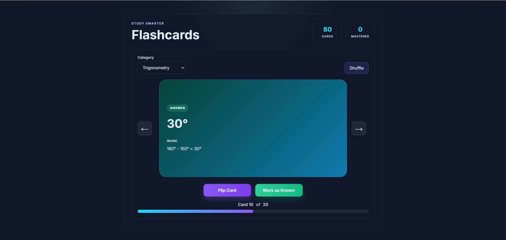
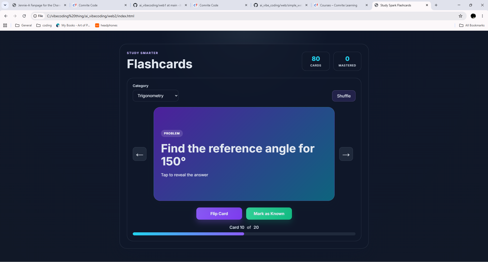

#Math Flashcards

This website is a flashcard site with 20 math problems a topic, with the answer and solution shown when you flip the card. This website covers algebra 1, geometry, albergra 2, and trigonometry.

